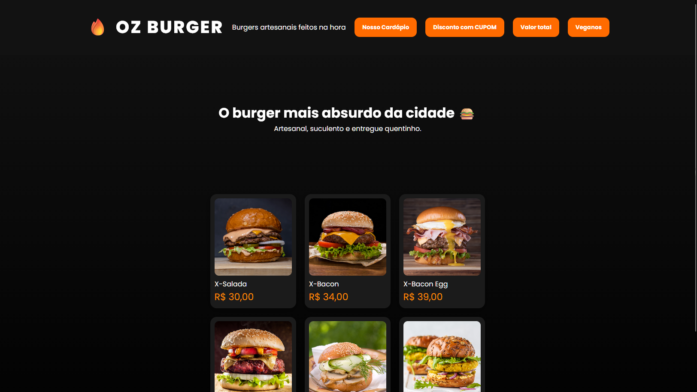
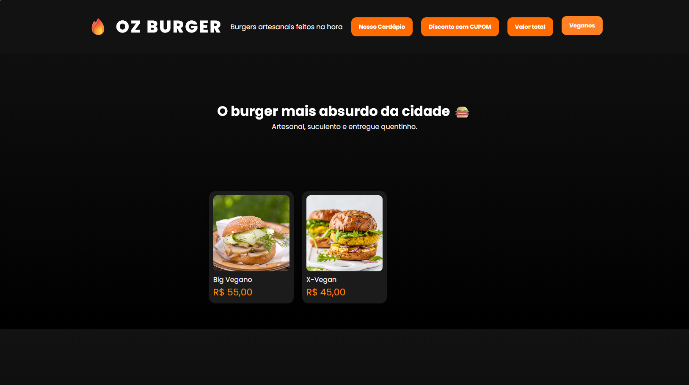

# OZ BURGER 🔥🍔

Aplicação web de uma hamburgeria que oferece burgers artesanais feitos na hora com opções veganas.

## Sobre o Projeto

**OZ BURGER** é um projeto desenvolvido durante o curso JavaScript da Dev Club. A aplicação permite aos clientes visualizar o cardápio, aplicar cupons de desconto, calcular o valor total e filtrar produtos veganos.

## Preview




## Funcionalidades

- 🍔 **Cardápio**: Exibe todos os produtos disponíveis com imagens, nomes e preços
- 💰 **Desconto**: Aplica 10% de desconto em todos os produtos usando cupom
- 🧮 **Valor Total**: Calcula a soma de todos os produtos do cardápio
- 🌱 **Filtro Vegano**: Exibe apenas os produtos veganos
- 💱 **Formatação de Moeda**: Todos os valores são exibidos em Real Brasileiro (R$)

## Produtos Disponíveis

| Produto | Preço | Tipo |
|---------|-------|------|
| X-Salada | R$ 30,00 | Regular |
| X-Bacon | R$ 34,00 | Regular |
| X-Bacon Egg | R$ 39,00 | Regular |
| Monstruoso | R$ 50,00 | Regular |
| Big Vegano | R$ 55,00 | Vegano |
| X-Vegan | R$ 45,00 | Vegano |

## Tecnologias Utilizadas

- **HTML5**: Estrutura da página
- **CSS3**: Estilização e layout responsivo
- **JavaScript (ES6+)**: Lógica da aplicação

### Conceitos JavaScript Aplicados

- ✅ **forEach()**: Iteração sobre produtos
- ✅ **map()**: Aplicação de descontos
- ✅ **reduce()**: Cálculo do valor total
- ✅ **filter()**: Filtragem de produtos veganos
- ✅ **Event Listeners**: Interatividade com botões

## Estrutura do Projeto

```
projeto-hamburgeria/
├── index.html          # Página principal
├── script.js           # Lógica da aplicação
├── products.js         # Catálogo de produtos
├── style.css           # Estilos
├── assets/             # Imagens dos produtos
│   ├── xsalada.jpeg
│   ├── xbacon.png
│   ├── bacon-egg.png
│   ├── monstruoso.png
│   ├── xvegan.png
│   └── monstruoso-vegan.png
└── README.md           # Este arquivo
```

## Como Usar

1. Abra o arquivo `index.html` em seu navegador
2. Clique nos botões para:
   - **Nosso Cardápio**: Visualizar todos os produtos
   - **Disconto com CUPOM**: Aplicar 10% de desconto
   - **Valor Total**: Ver o valor total dos produtos
   - **Veganos**: Filtrar apenas produtos veganos

## Como Executar Localmente

1. Clone ou baixe o repositório
2. Navegue até a pasta do projeto
3. Abra o arquivo `index.html` em seu navegador preferido

Não há dependências externas - tudo funciona com JavaScript vanilla!

## Autor

Desenvolvido durante o curso JavaScript da **Dev Club**.

---

**Burgers artesanais feitos na hora** 🔥🍔
